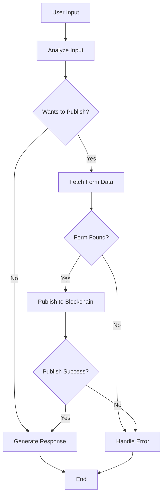

# AI Agent Blockchain Publishing Documentation

## Overview

The AI Agent provides an intelligent interface for publishing forms to the blockchain using a LangGraph-based workflow. It analyzes user input, fetches form data from MongoDB, publishes to the blockchain via verifiable contracts, and generates dynamic responses with public URLs.

## Architecture

### LangGraph Workflow States

The agent operates through a state machine with the following states:

```python
class AgentState(Enum):
    LISTENING = "listening"
    ANALYZING = "analyzing"
    FETCHING_FORM = "fetching_form"
    PUBLISHING = "publishing"
    RESPONDING = "responding"
    ERROR = "error"
```

### Workflow Flow



## Core Features

### 1. Intent Analysis

The agent uses Ollama to analyze user input for publishing intent:

```python
async def analyze_input(self, state: AgentStateData) -> AgentStateData:
    """Analyze user input for publishing intent"""
    analysis = await ollama_service.analyze_publish_intent(state["user_input"])
    state["analysis_result"] = analysis
    
    if analysis.get("form_id"):
        state["form_id"] = analysis["form_id"]
```

**Supported Input Patterns:**
- `publish form [form_id]`
- `deploy form [form_id]`
- `register form [form_id]`
- `send form [form_id] to blockchain`

### 2. Form Data Retrieval

Fetches form data and JSON fingerprint from MongoDB:

```python
async def fetch_form_data(self, state: AgentStateData) -> AgentStateData:
    """Fetch form data from MongoDB"""
    # Fetch form data
    form_data = await mongodb_service.get_form_by_id(state["form_id"])
    
    # Extract JSON fingerprint
    fingerprint = await mongodb_service.get_form_fingerprint(state["form_id"])
    
    state["form_data"] = form_data
    state["json_fingerprint"] = fingerprint
```

### 3. Blockchain Publishing

Publishes forms to the blockchain via verifiable contracts:

```python
async def publish_to_blockchain(self, state: AgentStateData) -> AgentStateData:
    """Publish form to blockchain via verifiable contract"""
    result = await verifiable_contract_service.register_url(
        state["form_id"],
        state["json_fingerprint"]
    )
    
    state["publish_result"] = result
```

## Public URL Generation

### URL Format

The agent constructs public URLs using the following format:

```
{FRONTEND_BASE_URL}/public/form/{form_id}/{json_fingerprint}
```

### Implementation

```python
# Construct the public URL using form ID and JSON fingerprint
public_url = f"{config.FRONTEND_BASE_URL}/public/form/{form_id}/{json_fingerprint}"
```

### Example URLs

```
# Development Environment
http://localhost:4200/public/form/68424bb77c8887c5c5eb4aed/11e174272bf81afe239794a0ab3362536c2c5d6beeb10223c9493daa5fb0cf31

# Production Environment  
https://app.example.com/public/form/68424bb77c8887c5c5eb4aed/11e174272bf81afe239794a0ab3362536c2c5d6beeb10223c9493daa5fb0cf31
```

## Response Generation

### Success Response Template

When a form is successfully published, the agent generates a comprehensive response:

```python
state["response_message"] = f"""✅ Form {form_id} has been successfully {operation_verb} to the blockchain!

🔗 Your form is now available at the public URL and verified on the blockchain.

📋 Form ID: {form_id}
🎯 Status: Published  
⛓️ Blockchain: Verified
🌐 Public URL: {public_url}
🔖 Transaction Hash: {tx_hash}

🎉 Your form is now immutably stored and publicly accessible!"""
```

### Dynamic Operation Verbs

The agent detects operation type from user input:

| User Input Contains | Operation Verb |
|-------------------|----------------|
| "deploy" | deployed |
| "register" | registered |
| "send" | sent |
| default | published |

### Error Handling

Comprehensive error handling for each stage:

```python
async def handle_error(self, state: AgentStateData) -> AgentStateData:
    """Handle errors and generate error response"""
    error_msg = state.get("error", "Unknown error occurred")
    form_id = state.get("form_id", "unknown")
    
    response = await ollama_service.generate_response_message(
        success=False,
        form_id=form_id,
        url=None,
        error=error_msg
    )
```

## Configuration

### Environment Variables

```bash
# Frontend base URL for public form access
FRONTEND_BASE_URL=http://localhost:4200

# MongoDB connection
MONGODB_URL=mongodb://localhost:27017
MONGODB_DB_NAME=doc2formjson

# Blockchain configuration
VERIFIABLE_CONTRACT_URL=http://localhost:8545
```

### Ollama Service Configuration

```bash
# Ollama timeout settings
OLLAMA_TIMEOUT=1200       # 20 minutes
OLLAMA_KEEP_ALIVE=15m     # 15 minutes
```

## Usage Examples

### Publishing a Form

**User Input:**
```
publish form 68424bb77c8887c5c5eb4aed
```

**Agent Response:**
```
✅ Form 68424bb77c8887c5c5eb4aed has been successfully published to the blockchain!

🔗 Your form is now available at the public URL and verified on the blockchain.

📋 Form ID: 68424bb77c8887c5c5eb4aed
🎯 Status: Published  
⛓️ Blockchain: Verified
🌐 Public URL: http://localhost:4200/public/form/68424bb77c8887c5c5eb4aed/11e174272bf81afe239794a0ab3362536c2c5d6beeb10223c9493daa5fb0cf31
🔖 Transaction Hash: 0xabc123...def789

🎉 Your form is now immutably stored and publicly accessible!
```

### Deploying a Form

**User Input:**
```
deploy form 68424bb77c8887c5c5eb4aed to blockchain
```

**Agent Response:**
```
✅ Form 68424bb77c8887c5c5eb4aed has been successfully deployed to the blockchain!
...
```

### Non-Publishing Request

**User Input:**
```
how do I publish a form?
```

**Agent Response:**
```
I'm here to help you publish forms to the blockchain. Just say 'publish form [form_id]' when you're ready!
```

## API Integration

### MongoDB Service Integration

```python
# Form data retrieval
form_data = await mongodb_service.get_form_by_id(form_id)
fingerprint = await mongodb_service.get_form_fingerprint(form_id)
```

### Verifiable Contract Service Integration

```python
# Blockchain publishing
result = await verifiable_contract_service.register_url(form_id, json_fingerprint)
```

### Ollama Service Integration

```python
# Intent analysis
analysis = await ollama_service.analyze_publish_intent(user_input)

# Response generation
response = await ollama_service.generate_response(prompt, system_message)
```

## Error Scenarios

### Common Error Cases

1. **Form Not Found**
   ```
   Form with ID {form_id} not found in database
   ```

2. **Missing JSON Fingerprint**
   ```
   JSON fingerprint not found for form {form_id}
   ```

3. **Blockchain Publishing Failure**
   ```
   Failed to publish form: {blockchain_error}
   ```

4. **Invalid Form ID**
   ```
   Form ID is required for publishing
   ```

## Monitoring and Logging

### Log Levels

```python
# Info level logging for workflow stages
logger.info(f"Analyzing input: {user_input}")
logger.info(f"Fetching form data for ID: {form_id}")
logger.info(f"Publishing form {form_id} to blockchain")

# Error level logging for failures
logger.error(f"Error in analyze_input: {e}")
logger.error(f"Failed to publish form: {error}")
```

### State Tracking

Each workflow step updates the current state:

```python
state["current_state"] = AgentState.ANALYZING.value
state["current_state"] = AgentState.FETCHING_FORM.value
state["current_state"] = AgentState.PUBLISHING.value
state["current_state"] = AgentState.RESPONDING.value
```

## Security Considerations

### Input Validation

- Form IDs are validated against MongoDB existence
- JSON fingerprints are verified before blockchain publishing
- User input is sanitized through Ollama analysis

### Blockchain Security

- Verifiable contracts ensure immutable form storage
- Transaction hashes provide audit trails
- Public URLs are cryptographically secured with fingerprints

## Performance Optimization

### Async Operations

All major operations are asynchronous:
- MongoDB queries
- Blockchain transactions
- Ollama API calls
- Response generation

### Connection Management

```python
# MongoDB connection reuse
if not mongodb_service.client:
    await mongodb_service.connect()
```

## Future Enhancements

### Planned Features

1. **Batch Publishing**: Support for publishing multiple forms
2. **Status Tracking**: Real-time publishing status updates
3. **Rollback Support**: Ability to unpublish forms
4. **Analytics**: Publishing success/failure metrics
5. **Notifications**: Email/webhook notifications for publishing events

### Scalability Considerations

- Connection pooling for MongoDB
- Redis caching for form data
- Load balancing for Ollama services
- Blockchain node redundancy

## Troubleshooting

### Common Issues

1. **Timeout Errors**: Increase `OLLAMA_TIMEOUT` configuration
2. **Connection Failures**: Check MongoDB and blockchain service availability
3. **Invalid Responses**: Verify Ollama model availability and configuration
4. **URL Generation**: Ensure `FRONTEND_BASE_URL` is correctly configured

### Debug Commands

```bash
# Test MongoDB connection
python -c "from mongodb_service import mongodb_service; import asyncio; asyncio.run(mongodb_service.connect())"

# Test Ollama service
curl http://localhost:11434/api/generate -d '{"model":"llama3.2:3b","prompt":"test"}'

# Test verifiable contract
curl http://localhost:8545/health
```

---

**Last Updated:** June 9, 2025  
**Version:** 1.0.0  
**Author:** AI Agent Development Team
