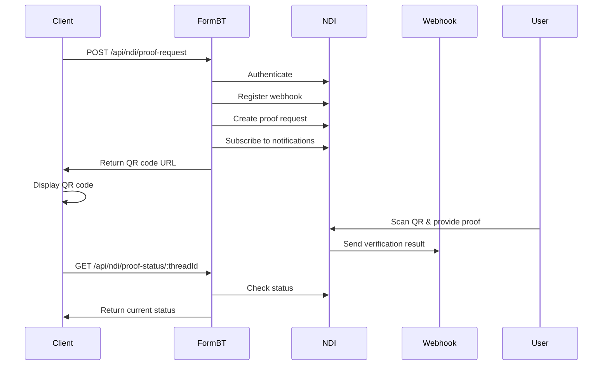

# NDI Public Controller Implementation Complete

## Overview
Successfully converted the Next.js NDI proof request handler to Express.js and created a comprehensive NDI integration system.

## Changes Made

### 1. Created NDI Controller
**File**: `server/src/controllers/ndiController.ts`

**Functions**:
- `createProofRequest()` - Creates NDI proof requests for identity verification
- `getProofStatus()` - Retrieves the status of a proof request by thread ID

**Features**:
- Removed ngrok dependency (uses configured FRONTEND_BASE_URL)
- Full NDI authentication flow
- Webhook registration and subscription
- Error handling and validation
- TypeScript type safety

### 2. Created NDI Routes
**File**: `server/src/routes/ndiRoutes.ts`

**Endpoints**:
- `POST /api/ndi/proof-request` - Create a new identity verification request
- `GET /api/ndi/proof-status/:threadId` - Get the status of a verification request

### 3. Updated Main Routes
**File**: `server/src/routes/index.ts`
- Added import and mounting for NDI routes under `/api/ndi`

### 4. Updated Controllers Index
**File**: `server/src/controllers/index.ts`
- Added export for NDI controller functions

### 5. Updated Docker Configuration
**File**: `docker-compose.ssl.yml`
- Added NDI environment variables:
  - `NDI_CLIENT_ID`
  - `NDI_CLIENT_SECRET`
  - `WEBHOOK_ID`
  - `WEBHOOK_TOKEN`

### 6. Created Test Script
**File**: `test-ndi-public.sh`
- Comprehensive testing for both endpoints
- Error handling validation
- Environment variable checklist

## API Endpoints

### POST /api/ndi/proof-request
Creates a new identity verification proof request.

**Request**: No body required
**Response**:
```json
{
  "success": true,
  "url": "https://demo-client.bhutanndi.com/proof-request/...",
  "threadId": "thread-id-for-tracking"
}
```

**Process**:
1. Authenticates with NDI using client credentials
2. Registers webhook endpoint for notifications
3. Creates proof request for "Foundational ID" verification
4. Subscribes to webhook notifications for the request
5. Returns QR code URL and thread ID for tracking

### GET /api/ndi/proof-status/:threadId
Retrieves the current status of a proof request.

**Parameters**: 
- `threadId` - The thread ID returned from proof request creation

**Response**:
```json
{
  "success": true,
  "status": {
    // NDI status response object
  }
}
```

## Required Environment Variables

Add these to your `.env.ssl` file:

```env
# NDI Configuration
NDI_CLIENT_ID=your-ndi-client-id
NDI_CLIENT_SECRET=your-ndi-client-secret
WEBHOOK_ID=your-webhook-id
WEBHOOK_TOKEN=your-webhook-token
```

## Integration with Existing Webhook System

This NDI public controller works seamlessly with the existing webhook system:

1. **Proof Request Creation** → Uses `/api/ndi/proof-request`
2. **Webhook Notifications** → Received at `/api/ndi-webhook` (previously implemented)
3. **Status Polling** → Uses `/api/ndi/proof-status/:threadId`

## NDI Verification Flow



## Usage Examples

### Frontend Integration (Angular)
```typescript
// Create proof request
async createProofRequest() {
  try {
    const response = await this.http.post('/api/ndi/proof-request', {}).toPromise();
    this.qrCodeUrl = response.url;
    this.threadId = response.threadId;
  } catch (error) {
    console.error('Failed to create proof request:', error);
  }
}

// Check proof status
async checkProofStatus() {
  try {
    const response = await this.http.get(`/api/ndi/proof-status/${this.threadId}`).toPromise();
    this.proofStatus = response.status;
  } catch (error) {
    console.error('Failed to get proof status:', error);
  }
}

// Poll for webhook results
async pollWebhookResults() {
  try {
    const response = await this.http.get('/api/ndi-webhook').toPromise();
    if (response.proof) {
      // Handle verification result
      this.verificationResult = response.proof;
    }
  } catch (error) {
    console.error('Failed to get webhook results:', error);
  }
}
```

### Testing
```bash
# Run comprehensive tests
./test-ndi-public.sh

# Test individual endpoints
curl -X POST https://formbt.com/api/ndi/proof-request
curl https://formbt.com/api/ndi/proof-status/thread-id-here
```

## Security Considerations

1. **Environment Variables**: Store NDI credentials securely
2. **Webhook Authentication**: Uses OAuth2 token for webhook security
3. **Error Handling**: Sensitive information not exposed in error messages
4. **CORS**: Properly configured for formbt.com domain

## Production Deployment

The NDI controller is fully integrated with the existing FormBT docker-compose stack:

```bash
# Deploy with NDI support
docker-compose -f docker-compose.ssl.yml up -d

# Test NDI endpoints
./test-ndi-public.sh
```

## Error Handling

The controller includes comprehensive error handling:
- NDI authentication failures
- Network timeouts
- Invalid responses
- Missing environment variables
- Webhook registration failures (non-blocking)

## Next Steps (Optional)

1. **Database Integration**: Store proof requests and results in MongoDB
2. **Rate Limiting**: Add rate limiting for proof request creation
3. **Caching**: Cache NDI access tokens to reduce API calls
4. **Monitoring**: Add logging and monitoring for NDI interactions
5. **Frontend UI**: Create user interface for identity verification

## File Structure
```
server/src/
├── controllers/
│   ├── index.ts (updated)
│   └── ndiController.ts (new)
├── routes/
│   ├── index.ts (updated)
│   ├── ndiRoutes.ts (new)
│   └── ndi-webhook.ts (existing)
└── ...
test-ndi-public.sh (new)
docker-compose.ssl.yml (updated)
```

The NDI public controller implementation is now complete and ready for production use!
