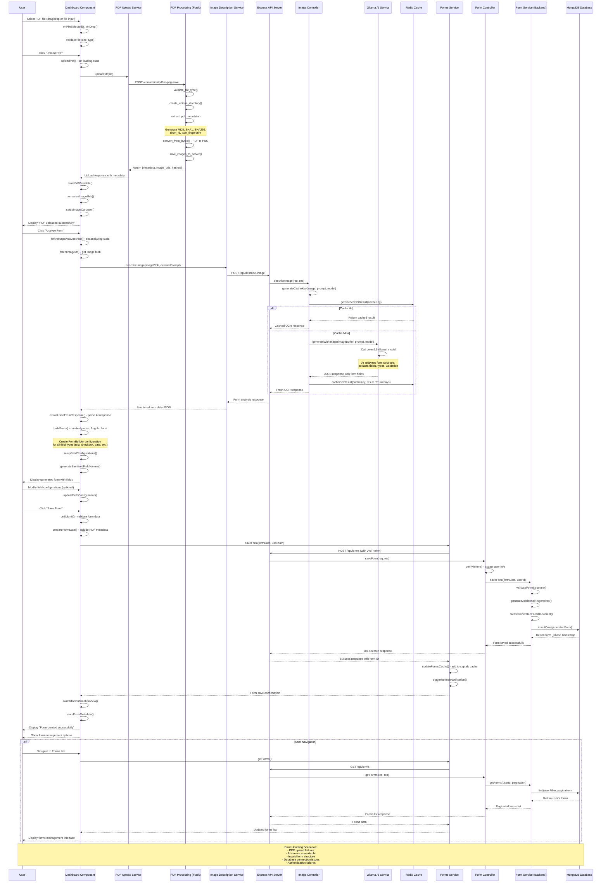

# Dashboard PDF Upload to Web Form Generation - Sequence Diagram

## Complete User Journey: PDF Upload → AI Analysis → Web Form Creation



## Key Components and Their Responsibilities

### **Frontend Layer**

#### **Dashboard Component** (`dashboard.component.ts`)
- **File Management**: PDF selection, validation, upload orchestration
- **UI State**: Loading states, error handling, progress indicators
- **Form Building**: Dynamic Angular form generation from AI response
- **User Interaction**: Form customization, field configuration
- **Navigation**: Confirmation views, form management integration

#### **PDF Upload Service** (`pdf-upload.service.ts`)
- **File Transfer**: HTTP upload to Flask PDF processing service
- **Response Handling**: Process PDF metadata and image URLs
- **Error Management**: Upload failure handling and retry logic

#### **Image Description Service** (`describe-image.service.ts`)
- **AI Integration**: Send images to backend for form analysis
- **Prompt Engineering**: Detailed prompts for accurate field extraction
- **Response Processing**: Parse AI-generated form structure

#### **Forms Service** (`forms.service.ts`)
- **Form Persistence**: Save generated forms to backend
- **Cache Management**: Angular signals-based caching
- **State Synchronization**: Update UI state across components

### **Backend Layer**

#### **PDF Processing Service** (Flask - `app.py`)
- **PDF Conversion**: Convert PDF pages to PNG images
- **Metadata Extraction**: Generate multiple hash fingerprints
- **File Management**: Serve converted images via HTTP URLs
- **Directory Management**: Organized file storage structure

#### **Image Controller** (`imageController.ts`)
- **Request Routing**: Handle AI analysis requests
- **Cache Management**: Redis integration for OCR result caching
- **AI Orchestration**: Coordinate with Ollama service
- **Response Formatting**: Structure AI responses for frontend

#### **Ollama Service** (`ollamaService.ts`)
- **AI Model Integration**: qwen2.5vl vision model interaction
- **Multimodal Processing**: Image + text prompt analysis
- **JSON Parsing**: Extract structured form data from AI response
- **Error Handling**: AI service availability and timeout management

#### **Form Controller & Service** (`formController.ts`, `formService.ts`)
- **Authentication**: JWT token validation and user extraction
- **Data Validation**: Form structure and field validation
- **Database Operations**: MongoDB document creation and management
- **User Isolation**: Ensure form ownership and access control

### **Data Storage Layer**

#### **Redis Cache**
- **OCR Results**: 7-day TTL for AI analysis results
- **Performance**: Avoid repeated AI processing for same images
- **Key Generation**: SHA256 fingerprints for cache keys

#### **MongoDB Collections**
- **generated_form**: Form definitions with metadata and user tracking
- **users**: User authentication and profile information
- **form_submissions**: Collected form data from users

## Data Transformation Pipeline

### **1. PDF → Images**
```
PDF File → Flask Service → pdf2image → PNG Images → HTTP URLs
```

### **2. Images → Form Structure**
```
PNG Image → Ollama qwen2.5vl → JSON Response → Parsed Form Fields
```

### **3. AI Response → Angular Form**
```
JSON Fields → FormBuilder Configuration → Reactive Forms → UI Components
```

### **4. Form Data → Database**
```
Angular Form → HTTP Request → Backend Validation → MongoDB Document
```

## Performance Optimizations

### **Caching Strategy**
- **Redis OCR Cache**: Prevent repeated AI processing
- **Frontend Forms Cache**: Signals-based reactive caching
- **Image URL Optimization**: Normalized URLs for production

### **Loading States**
- **Upload Progress**: File transfer progress indicators
- **AI Processing**: Analysis progress with estimated time
- **Form Building**: Dynamic form generation feedback
- **Save Operations**: Database persistence confirmation

### **Error Recovery**
- **Retry Logic**: Failed uploads and API calls
- **Graceful Degradation**: Fallback for AI service unavailability
- **User Feedback**: Clear error messages and suggested actions

## Security Considerations

### **Authentication Flow**
- **JWT Tokens**: Required for all form operations
- **User Context**: Forms associated with authenticated users
- **Token Validation**: Backend verification on every request

### **File Security**
- **Type Validation**: PDF format verification
- **Size Limits**: Prevent large file uploads
- **Temporary Storage**: Secure file handling and cleanup

### **Data Privacy**
- **User Isolation**: Forms filtered by ownership
- **Input Sanitization**: Form field name sanitization
- **Access Control**: Role-based permissions for form management

This sequence diagram illustrates the complete journey from PDF upload to fully functional web form, showing all the microservices interactions, data transformations, and user experience touchpoints in the DynaForm platform.