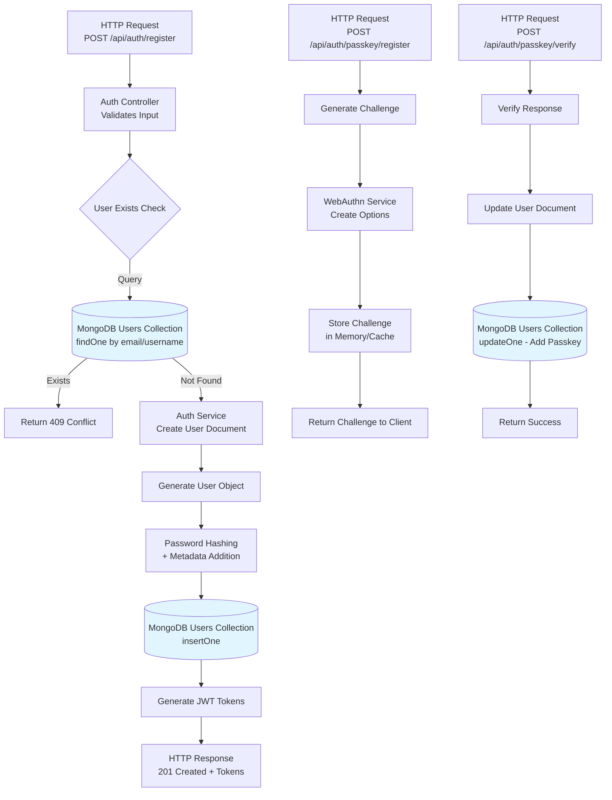
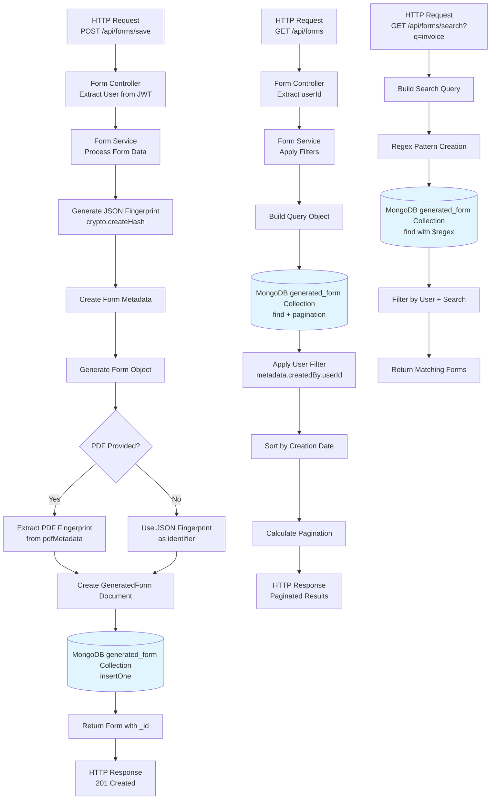
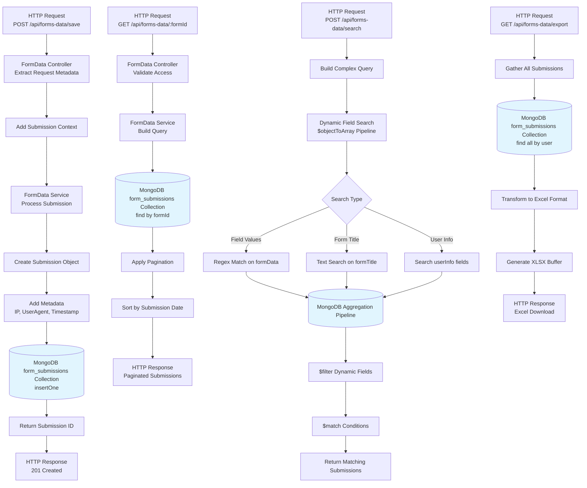
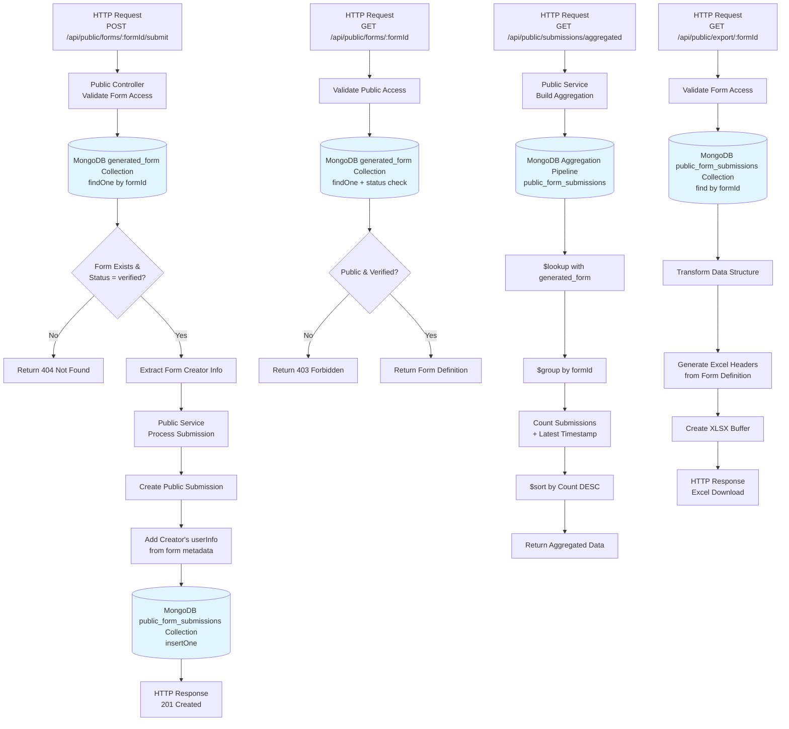
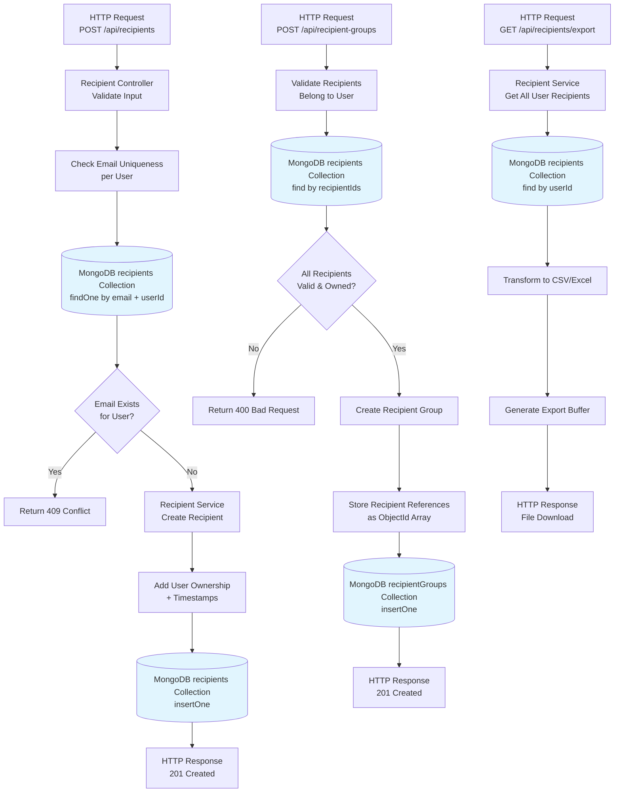
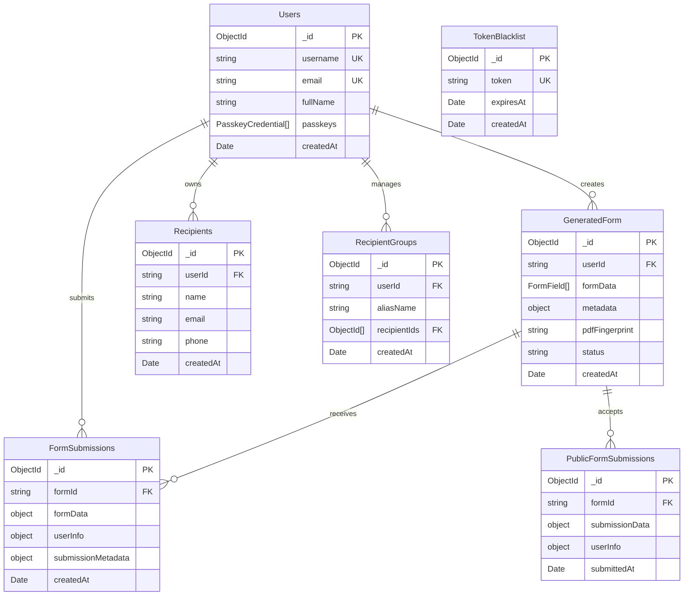

# MongoDB Data Flow Diagrams

## 1. User Authentication Data Flow



## 2. Form Creation and Management Data Flow



## 3. Form Submission Data Flow



## 4. Public Form Submission Data Flow



## 5. Recipient Management Data Flow



## 6. AI Integration and Caching Data Flow

```mermaid
flowchart TD
    A[HTTP Request<br/>POST /api/describe-image] --> B[Image Controller<br/>Process Upload]
    B --> C[Generate Cache Key<br/>SHA256(image + prompt + model)]
    C --> D{Check Redis Cache}
    D -->|Hit| E[Return Cached Result]
    D -->|Miss| F[Ollama Service<br/>Process Image]
    F --> G[AI Model Processing<br/>qwen2.5vl:latest]
    G --> H[Parse JSON Response<br/>Extract Form Fields]
    H --> I[Cache Result in Redis<br/>TTL: 7 days]
    I --> J[Structure Form Fields]
    J --> K[HTTP Response<br/>Extracted Fields]
    
    %% Cache Performance Monitoring
    L[HTTP Request<br/>GET /api/cache/stats] --> M[Redis Cache Service<br/>Get Statistics]
    M --> N[Calculate Hit Rate<br/>+ Performance Metrics]
    N --> O[HTTP Response<br/>Cache Analytics]
    
    %% Form Field Processing
    P[Extracted Fields JSON] --> Q[Validate Field Structure]
    Q --> R[Convert to FormField Objects]
    R --> S[Add Field Configurations<br/>validation, styling]
    S --> T[Ready for Form Creation<br/>Save to MongoDB]
    
    %% OCR Result Caching Strategy
    U[Image Buffer + Prompt] --> V[Generate Fingerprint]
    V --> W{Fingerprint Exists<br/>in Redis?}
    W -->|Yes| X[Return Cached OCR]
    W -->|No| Y[Process with AI]
    Y --> Z[Cache New Result]
    Z --> AA[Return Fresh OCR]

    style D fill:#ffecb3
    style I fill:#ffecb3
    style W fill:#ffecb3
    style Z fill:#ffecb3
```

## 7. MongoDB Collection Relationships



## 8. Query Performance and Indexing Strategy

```mermaid
flowchart TD
    A[Query Performance Analysis] --> B[Collection Indexing Strategy]
    
    B --> C[Users Collection Indexes]
    C --> D[username: unique]
    C --> E[email: unique]
    C --> F[createdAt: -1]
    
    B --> G[GeneratedForm Collection Indexes]
    G --> H[metadata.createdBy.userId: 1,<br/>metadata.createdAt: -1]
    G --> I[pdfFingerprint: 1]
    G --> J[status: 1]
    
    B --> K[FormSubmissions Collection Indexes]
    K --> L[formId: 1,<br/>submissionMetadata.submittedAt: -1]
    K --> M[userInfo.userId: 1]
    
    B --> N[Recipients Collection Indexes]
    N --> O[userId: 1, email: 1]
    N --> P[createdAt: -1]
    
    Q[Common Query Patterns] --> R[User-Specific Data<br/>Filter by userId]
    Q --> S[Time-Based Queries<br/>Sort by createdAt/updatedAt]
    Q --> T[Search Operations<br/>Text/Regex patterns]
    Q --> U[Relationship Lookups<br/>Cross-collection joins]
    
    V[Performance Optimizations] --> W[Pagination Implementation<br/>skip() + limit()]
    V --> X[Compound Index Usage<br/>Multi-field queries]
    V --> Y[Redis Caching Layer<br/>7-day TTL for OCR]
    V --> Z[Aggregation Pipelines<br/>Complex data analysis]

    style C fill:#e8f5e8
    style G fill:#e8f5e8
    style K fill:#e8f5e8
    style N fill:#e8f5e8
```

## Key Data Flow Characteristics

### **Transaction Patterns**
- **Atomic Operations**: Single document operations are atomic
- **No Distributed Transactions**: Operations are designed to be independent
- **Eventual Consistency**: Cache invalidation with Redis integration

### **Error Handling Strategy**
- **Validation Errors**: Input validation before database operations
- **Constraint Violations**: Unique index conflicts handled gracefully
- **Reference Integrity**: Manual validation for cross-collection relationships
- **Timeout Handling**: Database connection timeout management

### **Performance Optimization**
- **Strategic Indexing**: Compound indexes for common query patterns  
- **Pagination**: Consistent skip/limit implementation across services
- **Caching Layer**: Redis integration for expensive AI operations
- **Query Optimization**: Aggregation pipelines for complex data analysis

### **Security Considerations**
- **User Isolation**: All queries filtered by user ownership
- **Input Sanitization**: MongoDB injection prevention
- **Authentication**: JWT token validation before database access
- **Role-Based Access**: Permission checks before data modifications