# Server Architecture - UML Class Diagram

```mermaid
classDiagram
    %% Core Types and Interfaces
    class ApiResponse~T~ {
        +success: boolean
        +data?: T
        +message?: string
        +error?: string
    }

    class PaginatedResponse~T~ {
        +data: T[]
        +totalPages: number
        +currentPage: number
        +totalItems: number
        +hasNextPage: boolean
        +hasPreviousPage: boolean
    }

    class FormField {
        +name: string
        +type: string
        +value?: string
        +label?: string
        +options?: string[]
        +required?: boolean
        +configuration?: FieldConfiguration
    }

    class FieldConfiguration {
        +validation?: object
        +visibility?: object
        +styling?: object
    }

    class GeneratedForm {
        +_id?: ObjectId
        +title: string
        +description?: string
        +fields: FormField[]
        +userId: string
        +createdAt: Date
        +updatedAt: Date
        +pdfFingerprint?: string
        +jsonFingerprint: string
        +shortId: string
        +isPublic?: boolean
    }

    class FormDataSubmission {
        +formId: string
        +submissionData: Record~string, any~
        +submitterInfo?: object
    }

    class SavedFormDataSubmission {
        +_id?: ObjectId
        +formId: string
        +formTitle: string
        +submissionData: Record~string, any~
        +submissionMetadata: object
        +createdAt: Date
        +updatedAt: Date
    }

    class Recipient {
        +_id?: ObjectId
        +name: string
        +email: string
        +phone?: string
        +userId: string
        +createdAt: Date
        +updatedAt: Date
    }

    class User {
        +_id?: ObjectId
        +username: string
        +email: string
        +passwordHash?: string
        +passkeys: PasskeyCredential[]
        +role: string
        +createdAt: Date
        +updatedAt: Date
    }

    class PasskeyCredential {
        +id: string
        +publicKey: Uint8Array
        +counter: number
        +transports?: string[]
        +createdAt: Date
    }

    %% Controllers Layer
    class FormController {
        -formService: FormService
        +saveForm(req, res): Promise~void~
        +getForms(req, res): Promise~void~
        +getFormById(req, res): Promise~void~
        +searchForms(req, res): Promise~void~
        +deleteForm(req, res): Promise~void~
        +updateForm(req, res): Promise~void~
        +getFormsByPdfFingerprint(req, res): Promise~void~
        +verifyForm(req, res): Promise~void~
    }

    class FormDataController {
        -formDataService: FormDataService
        +saveFormData(req, res): Promise~void~
        +getFormData(req, res): Promise~void~
        +getFormSubmissions(req, res): Promise~void~
        +getAllFormData(req, res): Promise~void~
        +deleteFormData(req, res): Promise~void~
        +searchFormData(req, res): Promise~void~
        +getUserFormData(req, res): Promise~void~
    }

    class ImageController {
        -ollamaService: OllamaService
        -redisCacheService: RedisCacheService
        +describeImage(req, res): Promise~void~
        +healthCheck(req, res): Promise~void~
        +summarizeText(req, res): Promise~void~
        +getCacheStats(req, res): Promise~void~
        +getCachePerformance(req, res): Promise~void~
        +clearCache(req, res): Promise~void~
    }

    class RecipientController {
        -recipientService: RecipientService
        +createRecipient(req, res): Promise~void~
        +getRecipients(req, res): Promise~void~
        +getRecipient(req, res): Promise~void~
        +updateRecipient(req, res): Promise~void~
        +deleteRecipient(req, res): Promise~void~
        +exportRecipients(req, res): Promise~void~
    }

    class PublicFormController {
        -publicFormService: PublicFormService
        +getPublicForm(req, res): Promise~void~
        +getFormByPdfFingerprint(req, res): Promise~void~
        +submitPublicForm(req, res): Promise~void~
        +getPublicSubmissions(req, res): Promise~void~
        +exportPublicSubmissions(req, res): Promise~void~
    }

    class AuthController {
        -authService: AuthService
        +register(req, res): Promise~void~
        +beginPasskeyRegistration(req, res): Promise~void~
        +finishPasskeyRegistration(req, res): Promise~void~
        +beginPasskeyAuthentication(req, res): Promise~void~
        +finishPasskeyAuthentication(req, res): Promise~void~
        +getPasskeys(req, res): Promise~void~
        +deletePasskey(req, res): Promise~void~
        +refreshToken(req, res): Promise~void~
        +logout(req, res): Promise~void~
        +getCurrentUser(req, res): Promise~void~
    }

    %% Services Layer
    class FormService {
        -formsCollection: Collection~GeneratedForm~
        +saveForm(formData): Promise~GeneratedForm~
        +getForms(userId, options): Promise~PaginatedResponse~GeneratedForm~~
        +getFormById(formId): Promise~GeneratedForm~
        +searchForms(userId, query, options): Promise~PaginatedResponse~GeneratedForm~~
        +updateForm(formId, updateData): Promise~GeneratedForm~
        +deleteForm(formId): Promise~boolean~
        +getFormsByPdfFingerprint(fingerprint): Promise~GeneratedForm[]~
        +verifyFormStatus(formId): Promise~object~
        -generateJsonFingerprint(formData): string
        -generateShortId(): string
        -generateFormMetadata(formData): object
    }

    class FormDataService {
        -formDataCollection: Collection~SavedFormDataSubmission~
        +saveFormData(submissionData): Promise~SavedFormDataSubmission~
        +getFormData(formId, options): Promise~PaginatedResponse~SavedFormDataSubmission~~
        +getFormSubmissions(userId, options): Promise~PaginatedResponse~SavedFormDataSubmission~~
        +getAllFormData(options): Promise~PaginatedResponse~SavedFormDataSubmission~~
        +deleteFormData(submissionId): Promise~boolean~
        +searchFormData(query, options): Promise~PaginatedResponse~SavedFormDataSubmission~~
        -generateFormDataSearchConditions(query): object
    }

    class OllamaService {
        -baseUrl: string
        -defaultModel: string
        -timeout: number
        +generateWithImage(imageBuffer, prompt, model): Promise~OllamaGenerateResponse~
        +generate(prompt, model): Promise~OllamaGenerateResponse~
        +healthCheck(): Promise~boolean~
    }

    class RedisCacheService {
        -redis: Redis
        -OCR_CACHE_TTL: number
        -CACHE_KEY_PREFIX: string
        +getCachedOcrResult(cacheKey): Promise~CachedOcrResult~
        +cacheOcrResult(cacheKey, result): Promise~void~
        +deleteCachedOcrResult(cacheKey): Promise~void~
        +getCacheStats(): Promise~object~
        +clearOcrCache(): Promise~void~
        +healthCheck(): Promise~boolean~
        -ensureConnection(): Promise~void~
        -generateCacheKey(buffer, prompt, model): string
    }

    class RecipientService {
        -recipientsCollection: Collection~Recipient~
        +createRecipient(recipientData): Promise~Recipient~
        +getRecipients(userId, options): Promise~PaginatedResponse~Recipient~~
        +getRecipient(recipientId): Promise~Recipient~
        +updateRecipient(recipientId, updateData): Promise~Recipient~
        +deleteRecipient(recipientId): Promise~boolean~
        +exportRecipients(userId): Promise~Buffer~
    }

    class AuthService {
        -webauthnService: WebAuthnService
        -usersCollection: Collection~User~
        +registerUser(userData): Promise~User~
        +generatePasskeyRegistrationOptions(userId): Promise~object~
        +verifyPasskeyRegistration(userId, response): Promise~boolean~
        +generatePasskeyAuthenticationOptions(): Promise~object~
        +verifyPasskeyAuthentication(response): Promise~AuthResult~
        +getUserPasskeys(userId): Promise~PasskeyCredential[]~
        +deletePasskey(userId, passkeyId): Promise~boolean~
        +generateTokens(userId): Promise~object~
        +refreshAccessToken(refreshToken): Promise~object~
        +revokeRefreshToken(refreshToken): Promise~void~
        +revokeAccessToken(accessToken): Promise~void~
        +isTokenBlacklisted(token): Promise~boolean~
        +getUserById(userId): Promise~User~
    }

    class WebAuthnService {
        +generateRegistrationOptions(user): Promise~object~
        +verifyRegistrationResponse(userId, response): Promise~object~
        +generateAuthenticationOptions(): Promise~object~
        +verifyAuthenticationResponse(response): Promise~object~
        +getUserPasskeys(userId): Promise~PasskeyCredential[]~
        +deletePasskey(userId, passkeyId): Promise~boolean~
    }

    %% Middleware
    class AuthMiddleware {
        +verifyToken(req, res, next): Promise~void~
        +requireRole(role): Function
        +optionalAuth(req, res, next): Promise~void~
    }

    %% Database Connection
    class DatabaseConnection {
        +connectToMongoDB(): Promise~void~
        +getDatabase(): Db
        +getClient(): MongoClient
        +closeConnection(): Promise~void~
    }

    %% Configuration
    class Config {
        +app: object
        +jwt: object
        +redis: object
        +mongodb: object
        +ollama: object
        +upload: object
    }

    %% Error Classes
    class OllamaError {
        +code?: string
        +statusCode?: number
        +details?: any
    }

    %% Relationships
    FormController --> FormService : uses
    FormDataController --> FormDataService : uses
    ImageController --> OllamaService : uses
    ImageController --> RedisCacheService : uses
    RecipientController --> RecipientService : uses
    PublicFormController --> PublicFormService : uses
    AuthController --> AuthService : uses
    
    FormService --> GeneratedForm : manages
    FormDataService --> SavedFormDataSubmission : manages
    RecipientService --> Recipient : manages
    AuthService --> User : manages
    AuthService --> WebAuthnService : uses
    
    SavedFormDataSubmission --|> FormDataSubmission : extends
    User --> PasskeyCredential : contains
    GeneratedForm --> FormField : contains
    FormField --> FieldConfiguration : contains
    
    OllamaError --|> Error : extends
    
    FormService --> DatabaseConnection : uses
    FormDataService --> DatabaseConnection : uses
    RecipientService --> DatabaseConnection : uses
    AuthService --> DatabaseConnection : uses
    
    AuthMiddleware --> Config : uses
    OllamaService --> Config : uses
    RedisCacheService --> Config : uses
```

## Architecture Overview

### **Layer Separation**
- **Controllers**: Handle HTTP requests/responses and coordinate with services
- **Services**: Contain business logic and data access
- **Middleware**: Cross-cutting concerns (authentication, validation)  
- **Types**: Shared interfaces and data models
- **Database**: MongoDB connection and collection management

### **Key Design Patterns**
- **Service Layer Pattern**: Business logic separated from controllers
- **Repository Pattern**: Data access abstracted through services
- **Dependency Injection**: Services injected into controllers
- **Middleware Pattern**: Authentication and error handling
- **Singleton Pattern**: Service instances exported as singletons

### **Data Flow**
1. **HTTP Request** → **Routes** → **Controllers** → **Services** → **Database**
2. **Controllers** coordinate between **Services**
3. **Services** handle business logic and database operations
4. **Middleware** provides authentication and validation
5. **Types** ensure type safety across all layers

### **Core Components**

#### **Form Management**
- `FormController` + `FormService`: CRUD operations for forms
- `FormDataController` + `FormDataService`: Handle form submissions
- `PublicFormController`: Public form access and anonymous submissions

#### **AI Integration** 
- `ImageController` + `OllamaService`: AI-powered form field extraction
- `RedisCacheService`: Caching for OCR results and performance

#### **User Management**
- `AuthController` + `AuthService`: Authentication and user management
- `WebAuthnService`: Passkey/WebAuthn implementation
- `AuthMiddleware`: JWT token verification and role-based access

#### **Data Management**
- `RecipientController` + `RecipientService`: Contact management
- `DatabaseConnection`: MongoDB connection management
- Type-safe data models with TypeScript interfaces